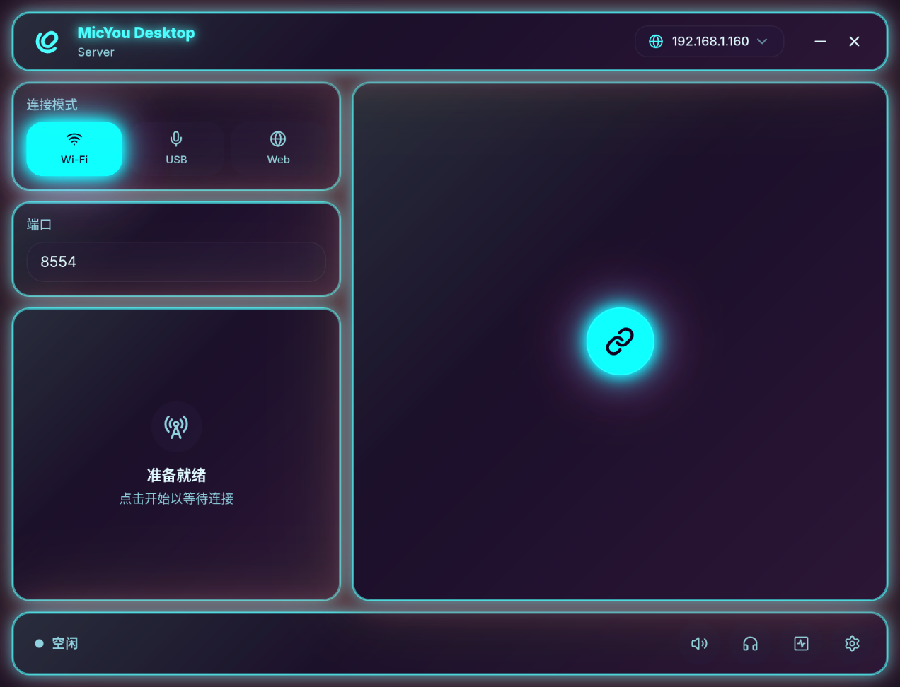

# MicYou Themes

<!-- Generated by scripts/generate_catalog.ts. Do not edit manually. -->

MicYou 的主题目录与主题包仓库。

## 仓库结构

```text
/
├── index.json                 # 自动生成的主题清单
└── theme/
    └── <theme-id>/
        ├── manifest.json      # 主题元数据（生成来源）
        ├── theme.css          # 主题样式
        └── preview.png        # 可选预览图
```

`index.json` 和本节下面的主题列表均由各主题目录中的 `manifest.json` 自动生成。

每个主题目录至少包含 `manifest.json` 和 CSS 入口文件，预览图是可选的。

主题清单中的 `controlsThemeColor` 用于声明主题是否接管 MicYou 的主题色生成器：

- `true` 或未填写：主题 CSS 可以接管主题色设置。
- `false`：主题只调整布局、形状等视觉细节，应用继续使用系统/预置主题色。

## 当前主题

| 预览 | ID | 名称 | 描述 | 版本 | 作者 | 主题色 |
| --- | --- | --- | --- | --- | --- | --- |
|  | `default-blue` | Default Blue | MicYou 的默认蓝色主题，提供浅色和深色 Material 3 主题变量。 | 1.0.0 | MicYou | 接管主题色 |
|  | `neon-pulse` | Neon Pulse | 霓虹青、品红与酸性绿构成的实验性赛博主题。 | 0.1.0 | MicYou | 接管主题色 |
|  | `square-corners` | Square Corners | 实验性直角界面主题，只调整形状，不接管主题色。 | 0.1.0 | MicYou | 不接管主题色 |

## 贡献主题

想要新增或修改主题，请先阅读 [`CONTRIBUTING.md`](CONTRIBUTING.md)。

## 生成

修改或新增主题后，在仓库根目录执行：

```sh
bun run generate
```

脚本会校验 manifest、入口 CSS 和预览图，并更新 `index.json` 与 `README.md`。
主分支上的主题变更也会由 GitHub Actions 自动执行该脚本。

## 安全说明

安装主题时只下载清单和 CSS，CSS 会在独立的主题包样式节点中应用。主题包不支持脚本，仓库中的主题内容不会执行任意代码。
